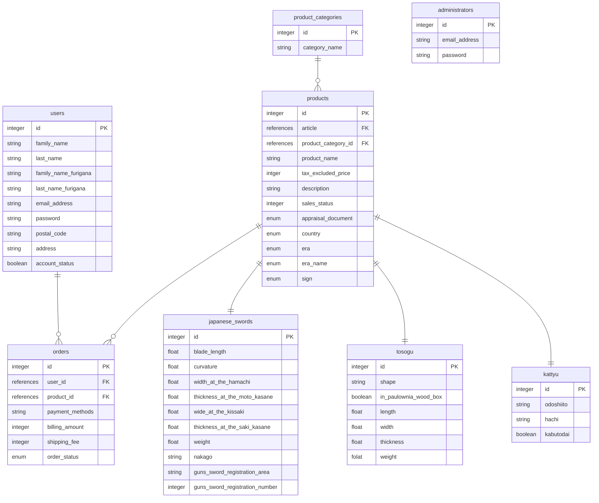

# Ruby on ralisでECサイトの作成
# 開発環境
- Ruby 3.2.2
- Rails 7.1.2
- MacOS sonoma 14.3
- WindowsOS 11(22H2)
    - Ubuntu 22.04.3LTS

# 導入手順
## windows
## Mac
rbenvのインストール
```
$ brew install rbenv ruby-build
```
バージョン確認
```
$ rbenv -v
```
zshrcファイルでrbenvの初期化
```
$ echo 'export RBENV_ROOT="$HOME/.rbenv"' >> ~/.zshrc
$ echo 'export PATH="$RBENV_ROOT/bin:$PATH"' >> ~/.zshrc
$ echo 'eval "$(rbenv init -)"' >>  ~/.zshrc
$ source ~/.zshrc
```

Railsのインストール
```
$ gem install rails
```
Visual Studio Codeのインストール

https://code.visualstudio.com/download

## ER図


▼draw.io


## ブランチ変更

* ブランチの新規作成とそのブランチへの切り替え
git checkout -b <ブランチ名>

* ブランチの作成
git branch <branch名>

* ブランチの切り替え
git checkout <branch名>

* gitのステータス
git status

* gitのログ
git log
