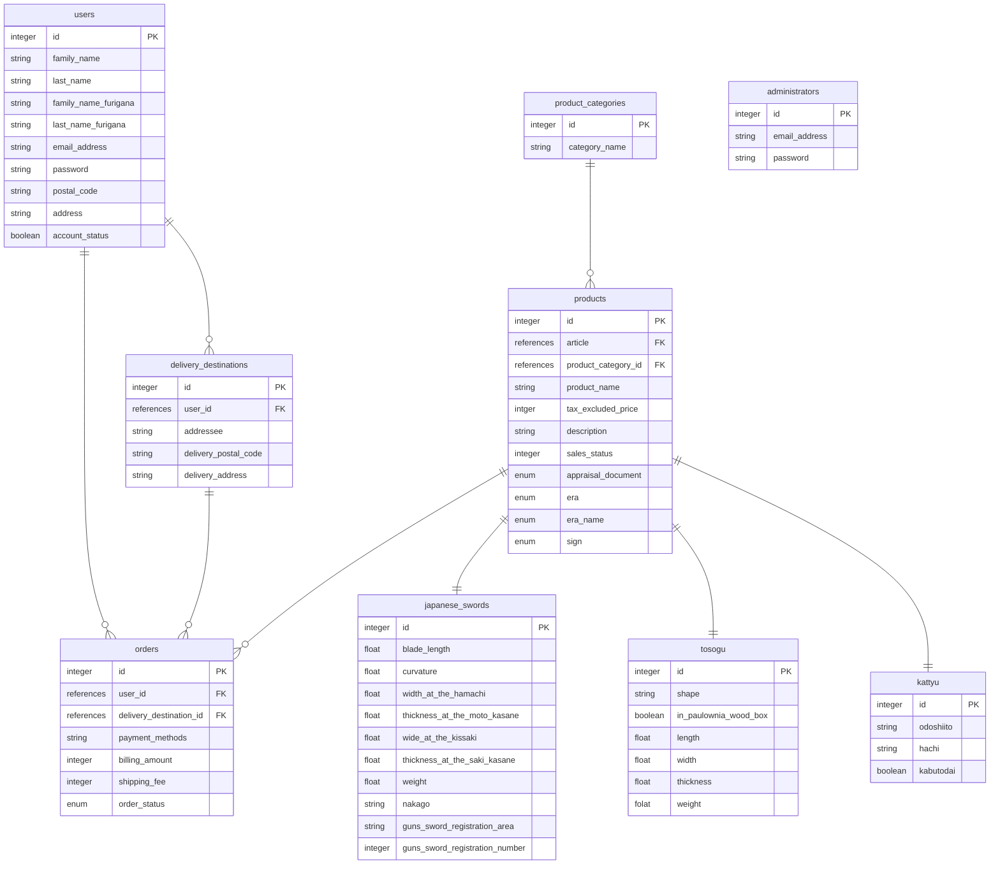

# Ruby on ralisでECサイトの作成
## 開発環境

## ER図
▼Memaid Chatを用いて設計

▼draw.ioを用いて設計

## ブランチ変更

* ブランチの新規作成とそのブランチへの切り替え
git checkout -b <ブランチ名>

* ブランチの作成
git branch <branch名>

* ブランチの切り替え
git checkout <branch名>

* gitのステータス
git status

* gitのログ
git log
